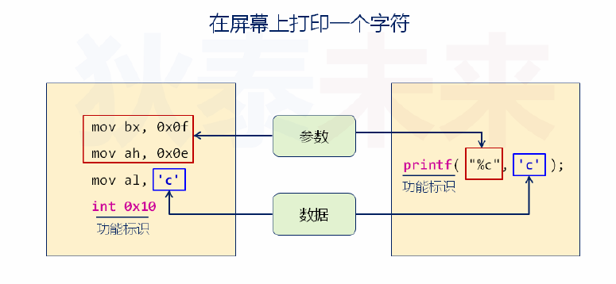
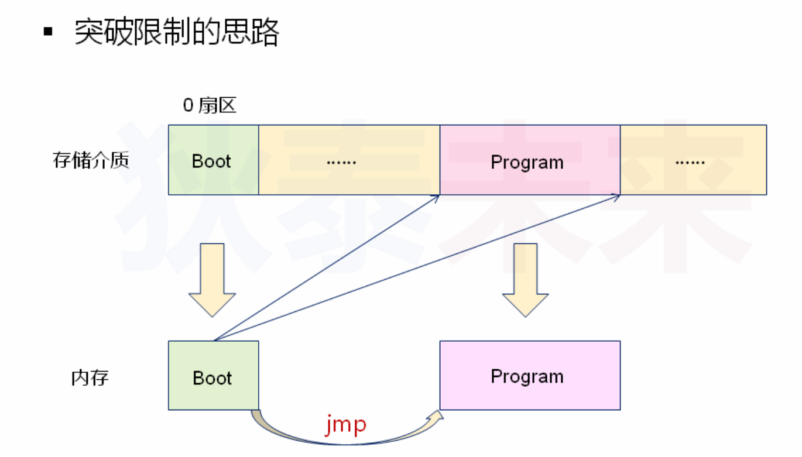
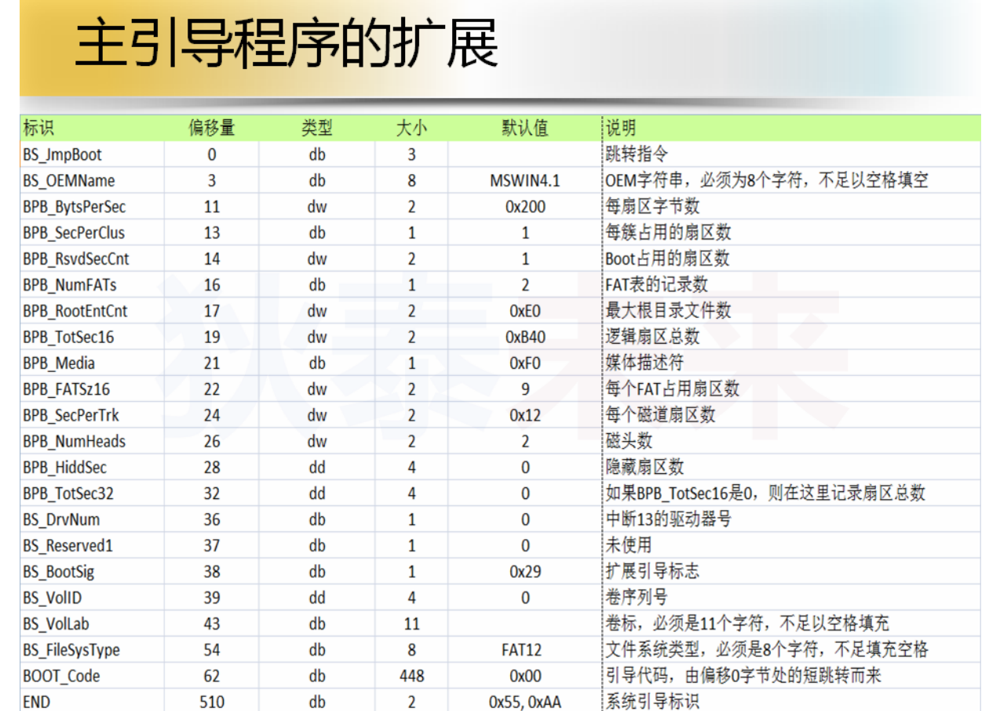

 # 进阶操作系统

## 第一课：进阶操作系统

- 什么是操作系统？
  - Windows, Linux, mac OS, Android, iOS, ...
  - 操作系统是直接运行于硬件之上的计算机程序
  - 操作系统用于管理和控制计算机的硬件与软件资源
  - 操作系统为用户软件的开发提供必要的服务和接口
- 现在计算机系统架构
  - 用户软件（编译软件）
  - 操作系统
  - BIOS（Basic Input Output System）
  - 硬件层
- BIOS-（Basic Input Output System）
  - BIOS 是计算机上电后的第一个运行程序
  - BIOS 首先检测硬件状态，检测通过后立即进行硬件初始化
  - BIOS 会在内存中建立终端向量表（提供硬件访问的方法）
  - BIOS 最后将控制权交由主引导程序执行
- BIOS不是软件（Software）而是固件（Firmware）
- 固件是固化于硬件中的程序，在硬件出厂前已经烧写固定了
- 系统启动流程
  - 上电->运行BIOS->硬件初始化
  - ->建立中断向量表->加载运行主引导程序->软件初始化
  - ->加载运行操作系统内核->系统初始化
- BIOS是如何被运行起来的？
  - BIOS 的运行机制
  - BIOS 存储于ROM中，地址映射为 0xF0000-0xFFFFF（实地址）
  - BIOS的入口地址为：0xFFFF0处开始执行
  - 硬件电路的特殊设计使得：开机后，CPU从0xFFFF0处开始执行
- BIOS最后的使命
  - 按照用户设置扫描各个存储介质（光驱，软驱，U盘）
  - 发现主引导区后，将主引导区中的主引导程序载入内存
  - 主引导程序在内存中的入口地址为0x7c00
  - 将控制权交由主引导程序执行（jmp 0x7c00）
- BIOS如何在存储介质中寻找主引导区？
- 如何判断引导区域中有没有主引导程序？
- 主引导区域（MBR：Master Boot Record）
  - 位置：位于存储介质的最开始的位置，大小为512字节
  - 特点：前512字节的最后两个有效字节为0x55aa
  - 数据：0x55aa之前的数据被视为主引导程序
- 小结
  - BIOS是计算机上电后的第一个运行的程序
  - BIOS进行必要的初始化，并加载运行主引导程序
  - 主引导程序位于存储介质的最开始512字节处
  - 主引导程序负责后续初始化，并加载运行操作系统内核

## 第二课：Hello, DTOS

- 问题：主引导程序是软件还是固件？

- 主引导程序

  - 一段存储在主引导区（MBR）中的有效代码
  - 并不固化于硬件，属于操作系统代码的一部分
  - 启动操作系统内核的桥梁，由汇编程序写成
  - 代码總量不能超过512字节（包含0x5aa）

- 主引导程序的开发

  - 入口：`0x7c00` -> 主引导程序（汇编语言）-> BIOS中断
  - 入口：`main` -> 应用程序（C/C++）-> OS系统调用

- 课程实验

  - 编写一个主引导程序（汇编语言）
  - 可独立运行于x86架构的主机（无操作系统）
  - 运行后可在屏幕上打印"Hello, DTOS!"

- 实现思路

  - 将关键寄存器的值设置为0（mov ax, 0）
  - 定义需要打印的数据（db "Hello, DTOS!"）
  - 打印预定义好的字符数据（int 0x10）

- 汇编小贴士：

  - mov：赋值操作，将右操作数赋值给左操作数

    - ```asm
      mov ax, 0	;将0赋值给ax寄存器
      ```

  - int：触发中断

    - ```asm
      int 0x10	;触发0x10中断，对屏幕进行操作
      ```

  - hlt：停止运行，CPU进入暂停状态，不执行任何操作

    - ```asm
      hlt			;使程序进入睡眠状态
      ```

  - 汇编中地址的访问方式：段地址：段内偏移地址

    - ```asm
      mov byte[0xb800:0x01], 0x07	;0xb800:0x01 -> 0xb8000 + 0x01 ->赋值操作
      ```

  - 标签

    - 用于标识后续指令的地址（等同于C语言中的goto）

  - `$` vs `$$`

    - `$` 表示当前指令的地址
    - `$$`表示当前汇编指令的起始地址

- 中断调用和函数调用的区别

  - 

- 编程实验

- 如何验证编写的主引导程序？

- 解决方案设计

  - 将汇编源码编译为二进制机器码（nasm）

  - 创建虚拟盘（bximage）

  - 将二进制代码写入虚拟盘起始位置（dd）

  - 在虚拟机中将虚拟盘作为启动盘执行（vmware）

- 实验原材料

  - nasm

    - ```shell
      $ nasm boot.asm -o boot.bin
      ```

  - bximage

    - ```shell
      $ bximage a.img -q -fd -size=1.44
      ```

  - dd

    - ```shell
      $dd if=boot.bin of=a.img bs=512 count=1 conv=notrunc
      ```

- 编程实验：

- ```asm
  org 0x7c00
  
  start:
  	mov ax, cs
  	mov ss, ax
  	mov ds, ax
  	mov es, ax
  	
  	mov si, msg
  	
  print:
  	mov al, [si]
  	add si, 1
  	cmp al, 0x00
  	je last
  	mov ah, 0x0e
      mov bx, 0x0f
  	int 0x10
  	jmp print
  
  last:
  	hlt
  	jmp last
  
  msg:
  	db 0x0a, 0x0a
  	db "Hello, DTOS!"
  	db 0x0a, 0x0a
  	times 510-($-$$) db 0x00
  	db 0x55, 0xaa
  
  ```

- 小结

  - 主引导程序的代码量不能超过512字节
  - 主引导程序需要使用汇编语言开发
  - 主引导程序中可以通过BIOS中断使用硬件功能
  - 主引导程序运行于实模式（地址都是实际的物理地址）

## 第三课：调试环境的搭建

- 问题：如何调试主引导区的代码？

- bochs （另外一款优秀的虚拟机软件）

  - 专业模拟x86架构的虚拟机
  - 开源且高度可移植，由c++编写完成
  - 支持操作系统开发过程的断点调试
  - 通过简单配置就能运行绝大多数主流的操作系统

- 安装方式，由于本机为x64位的主机，因此参考网上配置（https://blog.csdn.net/qq_26822029/article/details/82734235）

  - 首先在https://sourceforge.net/projects/bochs/files/bochs/2.6.8/下载源代码`[bochs-2.6.8.tar.gz]`

  - 然后开始编译，指定了安装路径，最重要的是要打开`--enable-debugger --enable-disasm`

  - 具体操作如下：

  - ```sh
    $ tar -zxf bochs-2.6.8.tar.gz
    $ cd bochs-2.6.8
    $ ./configure --prefix=/home/herryao/Software/bochs --enable-debugger \
    $ --enable-disasm --enable-iodebug --enable-x86-debugger \
    $ --with-x --with-x11
    $ sudo make -j
    $ sudo make install -j
    ```

  - 顺便输出一下环境变量，放在`.zshrc`下

  - ```sh
    export PATH="/home/herryao/Software/bochs/bin:$PATH"
    ```

- 小贴士：

  - 确定bochs的安装路径（`which bochs`）
  - 安装vgabios（`sudo apt install vgabios`）
  - 确定vgabios的安装路径（`whereis vgabios `）

- 调试环境的搭建

- Bochs的启动文件

- ```txt
  ###############################################################
  # Configuration file for Bochs
  ###############################################################
  
  # how much memory the emulated machine will have
  megs: 32
  
  # filename of ROM images
  romimage: file=/home/herryao/Software/bochs/share/bochs/BIOS-bochs-latest
  vgaromimage: file=/usr/share/vgabios/vgabios.bin
  
  # what disk images will be used
  floppya: 1_44=a.img, status=inserted
  
  # choose the boot disk.
  boot: floppy
  
  # where do we send log messages?
  # log: bochsout.txt
  
  # disable the mouse
  mouse: enabled=0
  
  # enable key mapping, using US layout as default.
  # keyboard_mapping: enabled=1, map=/home/herryao/Software/bochs/share/bochs/keymaps/x11-pc-us.map
  keyboard: type=mf, keymap=/home/herryao/Software/bochs/share/bochs/keymaps/x11-pc-us.map
  
  ```

- `keyboard_mapping`和`map`应该是过期了，换成了`keyboard`和`keymap`。

- 启动bochs虚拟机：

  - 显示方式：`bochs -f bochsrc_file`
  - 隐式方式：`bochs`命令会主动搜寻当前路径下的：
    - `.bochsrc`
    - `bochsrc`
    - `bochsrc.txt`

- bochs调试的常用命令，几乎同`gdb`一致

- | 命令               | 功能                 | 示例          |
  | ------------------ | -------------------- | ------------- |
  | b(break)           | 设置断点             | b 0x7c00      |
  | c(continue)        | 继续执行             | c             |
  | s(step)            | 单步执行             | s             |
  | info b(info break) | 查看当前所有断点     | info b        |
  | info cpu           | 查看当前cpu状态      | info cpu      |
  | r(reg)             | 查看当前寄存器状态   | r             |
  | sreg               | 查看段寄存器状态     | sreg          |
  | x/Nuf expression   | 查看内存中的数据     | x /2bx 0x7c00 |
  | trace on[off]      | 开关：打印执行的指令 | trace on      |
  | trace-reg on[off]  | 开关：打印寄存器的值 | trace-reg on  |

- 小结

  - Bochs是一款专业模拟x86架构的虚拟机
  - 从源码安装Bochs可以获得调试功能
  - Bochs的启动配置文件是正确运行的关键
  - Bochs支持断点调试，其调试命令与GDB类似


## 第四课：主引导程序的扩展（上）

- 限制：主引导程序的代码不能超过512字节
- 突破限制的思路
  - 完成最基本的初始化工作
  - 从存储介质中加载程序到内存中
  - 将控制权交由新加载的程序执行



- 问题：主引导程序如何加载存储介质中的其他程序？
  - 编程时我们可以通过系统调用直接读取文件
  - 但是在直接运行在硬件上的程序没有操作系统支持
  - 解决方案，文件系统。
- 文件系统
  - 存储介质上组织文件数据的方法（数据组织的方法）
  - FAT12文件格式：（基于软盘系统，已经被舍弃，目前只用于学习使用）
    - 数据区
    - 根目录区
    - FAT2
    - FAT1
    - 引导扇区
- 文件系统示例
  - FAT1同FAT2几乎没有区别，两者相互备份协同使用
  - FAT12 是DOS时代的早期文件系统
  - FAT12结构非常简单，一直沿用于软盘
  - FAT12的基本组织单位
    - 字节（byte）：基本数据单位
    - 扇区（sector）：磁盘中的最小数据单元（512 byte）
    - 簇（cluster）：一个或多个扇区

- 解决方案

  - 使用FAT12对虚拟软盘（data.img）进行格式化
  - 编写可执行程序（loader），并将其拷贝到软盘中
  - 主引导程序（boot）在文件系统中查找loader
  - 将loader复制到内存中，并跳转到入口执行

- 编程实验一：往虚拟软盘中写入文件

  - 原材料：FreeDos，Bochs，bximage

  - 步骤

    - 创建虚拟软盘`data.img`
    - 在FreeDos中进行格式化（`FAT12`）
    - 将`data.img`挂在到linux中，并写入文件

  - 使用`freedos.img`镜像作为格式化的工具，`A：`盘

  - 添加了一个用于存储FAT 文件的fd镜像`data.img`作为`B：`盘

  - 其余设置不变，修改后的`bochsrc.txt`文件内容如下：

  - ```txt
    ###############################################################
    # Configuration file for Bochs
    ###############################################################
    
    # how much memory the emulated machine will have
    megs: 32
    
    # filename of ROM images
    romimage: file=/home/herryao/Software/bochs/share/bochs/BIOS-bochs-latest
    vgaromimage: file=/usr/share/vgabios/vgabios.bin
    
    # what disk images will be used
    floppya: 1_44=freedos.img, status=inserted
    floppyb: 1_44=data.img, status=inserted
    
    # choose the boot disk.
    boot: floppy
    
    # where do we send log messages?
    # log: bochsout.txt
    
    # disable the mouse
    mouse: enabled=0
    
    # enable key mapping, using US layout as default.
    # keyboard_mapping: enabled=1, map=/home/herryao/Software/bochs/share/bochs/keymaps/x11-pc-us.map
    keyboard: type=mf, keymap=/home/herryao/Software/bochs/share/bochs/keymaps/x11-pc-us.map
    ```

  - 具体在terminal中的操作如下，软件内部操作省略。

  - ```bash
    $ bximage	#creat one fd image file named data.img
    $ bochs		#open the free dos, format the B: within the freedos
    $ sudo mkdir /mnt/hgfs	#create one folder for mount
    $ sudo mount -o loop data.img /mnt/hgfs
    $ vim test.txt	#input test data
    $ vim loader.bin	#input loader data
    $ sudo cp test.txt /mnt/hgfs
    $ sudo cp loader.bin /mnt/hgfs #copy the test files into the image files, then check in the bochs
    $ sudo umount /mnt/hgfs	#unmount the image
    $ vim data.img	#check the FAT12 file, using :%!xxd to check the binary file, using '/' to check if the data input existing in the FAT12 file
    ```

- 深入FAT12文件系统

  - FAT12文件系统由引导区，FAT表，根目录表以及文件数据区组成。

  - | 扇区位置 |     长度     |    内容    |
    | :------: | :----------: | :--------: |
    |    0     |  1（512 B）  |  引导程序  |
    |    1     | 9（4608 B）  |   FAT表1   |
    |    10    | 9（4608 B）  |   FAT表2   |
    |    19    | 14（9728 B） | 目录文件项 |
    |    33    |     ---      |  文件数据  |

- FAT12的主引导区

  - 主引导区存储的比较重要的信息是`文件系统的类型`，`文件系统逻辑扇区总数`，`每簇包含的扇区数`等。
  - 主引导区最后以`0x55aa` 两个字节作为结束，共占用一个扇区。
  - 

- 编程实验二：读取data.img中的文件系统信息
- `QT实验`
- 步骤：
  - 创建Fat12Header结构体类型
  - 使用文件流读取前512字节的内容（第0扇区）
  - 解析并打印相关的信息
- 将`bochsrc.txt`里面的内容修改，把data.img设置为启动盘然后运行
- ```txt
  ###############################################################
  # Configuration file for Bochs
  ###############################################################
  
  # how much memory the emulated machine will have
  megs: 32
  
  # filename of ROM images
  romimage: file=/home/herryao/Software/bochs/share/bochs/BIOS-bochs-latest
  vgaromimage: file=/usr/share/vgabios/vgabios.bin
  
  # what disk images will be used
  #floppya: 1_44=freedos.img, status=inserted
  floppya: 1_44=data.img, status=inserted
  #floppyb: 1_44=data.img, status=inserted
  
  # choose the boot disk.
  boot: floppy
  
  # where do we send log messages?
  # log: bochsout.txt
  
  # disable the mouse
  mouse: enabled=0
  
  # enable key mapping, using US layout as default.
  # keyboard_mapping: enabled=1, map=/home/herryao/Software/bochs/share/bochs/keymaps/x11-pc-us.map
  keyboard: type=mf, keymap=/home/herryao/Software/bochs/share/bochs/keymaps/x11-pc-us.map
  
  ```
- 实验结论

  - 发现运行bochs后，存在一个系统，这说明FreeDos中的format程序在格式化软盘是自动在其第0扇区生成了一个主引导程序，这个主引导程序只负责打印一个字符串。
  - 文件格式和文件系统都是定义数据如何存放的规则，只要遵循这个规则就可以成功读写目标数据。
- 小结

  - 主引导程序的代码不能超过512字节
  - 可以通过主引导程序加载新程序的方式突破限制
  - 加载心程序需要依赖于文件系统
  - FAT12是一种早起用于软盘的简单文件系统
  - FAT12文件系统的重要信息存储于0扇区

## 第五课：主引导程序的扩展（下）

- 问题：如何在FAT12根目录中查找是否存在目标文件？

- 根目录去的大小和位置

- 大小：$\frac{BPB\_RootEntCnt * sizeof(RootEntry)}{BPB_BytsPerSec}$

- | 扇区位置 |     长度     |    内容    |
  | :------: | :----------: | :--------: |
  |    0     |  1（512 B）  |  引导程序  |
  |    1     | 9（4608 B）  |   FAT表1   |
  |    10    | 9（4608 B）  |   FAT表2   |
  |    19    | 14（9728 B） | 目录文件项 |
  |    33    |     ---      |  文件数据  |

- `目录文件项`中包含所有文件的信息，包含文件的大小，文件的修改日期

- FAT12文件系统中的根目录区

  - 根目录区由目录项构成，每一个目录项代表根目录中的一个文件索引。

  - | 数据成员     | 偏移 | 长度 | 描述                     |
    | ------------ | ---- | ---- | ------------------------ |
    | DIR_Name     | 0x00 | 0x0B | 文件名8字节，扩展名2字节 |
    | DIR_Attr     | 0x0B | 0x01 | 文件属性                 |
    | Reserve      | 0x0C | 0x0A | 保留位                   |
    | DIR_WrtTime  | 0x16 | 0x02 | 最后一次写入时间         |
    | DIR_WrtDate  | 0x18 | 0x02 | 最后一次写入日期         |
    | DIR_FstClus  | 0x1A | 0x02 | 文件开始的簇号           |
    | DIR_FileSize | 0x1C | 0x04 | 文件大小                 |

- 编程实验：读取FAT12文件系统的根目录信息

- 步骤

  - 创建RootEntry结构体类型
  - 使用文件流顺序读取每个目录项的内容
  - 解析并打印相关的信息

- `QT实验`

- 目录项中的关键成员

  - DIR_Name
    - 文件名（用于判断是否位目标文件）
  - DIR_FstClus
    - 文件数据起始存储位置（用于确定读取位置）
  - DIR_FileSize
    - 文件大小（用于确定读取的字节数）

- 在FAT12中一个簇只有一个扇区，意味着一个簇只有512字节，但是一般而言文件都会大雨512字节，那么在FAT12中是如何解决这一问题的呢？

- 在分布排列的簇中，每个簇不一定是按顺序连续排列的，很有可能是分散开来的，因此对于簇的排列就很重要，解决方案（FAT表）

- FAT表-FAT12的数据组织核心

  - FAT1和FAT2是相互备份的关系，数据内容完全一致
  - FAT表是一个关系图，记录了文件数据的先后关系
  - 每一个FAT表暂用12bit（1.5字节，源自于历史原因）
  - **FAT表的前两个表项规定不使用**

- FAT表中的先后关系

  - 以簇（扇区）为单位存储文件数据
  - 每个表项（vec[i]）表示文件数据的实际位置
    - DIR_FstClus表示文件第0簇（扇区）的位置
    - vec[DIR_FstClus]表示文件第1簇（扇区）的位置
    - vec[vec[DIR_FstClus]]表示文件第2簇（扇区）的位置
    - 以此类推。。。。。。

- FAT数据逻辑示意图一

- FAT数据逻辑示意图二（链表）

- 编程实验二：加载FAT12中的文件数据

- 步骤

  - 在根目录中查找目标文件对应的项
  - 获取目标文件的其实簇号和文件大小
  - 根据FAT表中记录的逻辑先后关系读取数据

- 小贴士一

  - FAR表中每个表项只占用12比特（1.5字节）
  - FAT表一共记录了BPB_BytsPerSec\*9/1.5个表项
  - 可以使用一个short（2byte）表示一个表项的值
  - 如果表项值大于等于0xFF8，则说明已经到达最后一个簇
  - 如果表项值等于0xFF7则说明当前簇已经损坏

- 小贴士二

  - 数据区起始簇（扇区）为33,地址为0x4200
  - 数据区其实地址所对应的编号为2（不为0）[FAT表中第一第二表项不可使用]
  - 因此，DIR_FstClus对应的地址为：
    - 0x4200 + (DIR_FstClus - 2) * 512

- QT实验

- 小结

  - FAT12根目录区记录了文件的起始簇号和长度
  - 通过查找根目录区能够确定是否存在目标文件
  - FAT12文件数据的组织使用了单链表的思想
    - 文件数据离散的分布于存储介质中
    - 文件数据通过FAT项进行关联

## 第六课：突破512字节限制（上）


